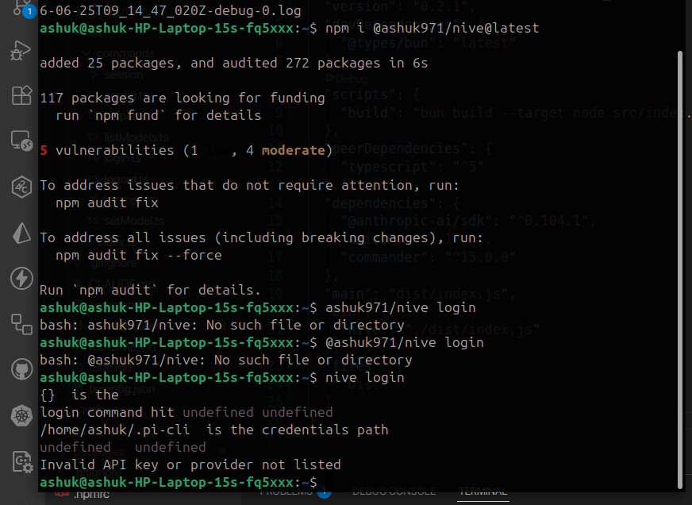

# PI-CLI

## MVP
- pi-cli commands through commander
- agent loop
- tool calls: read, write, edit, bash
- session: 
- memory and context
- publish as the package

## Future Scope
- guard rails
- Skills
- Subagents or Multi models spawning 
- MCP
- RAG pipeline
- Agents orchestration

## Progress 
 
MVP published to npm 

