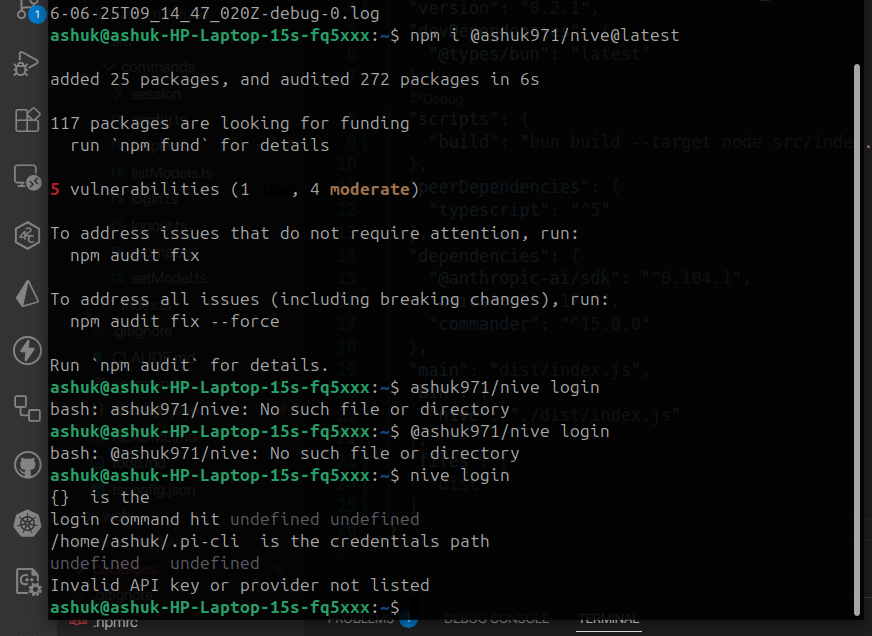

# AEON

Your personal coding companion — an AI agent that lives in your terminal, with a full terminal UI.
It reads your files, edits them, runs commands, and asks before it touches anything.

## Install

**macOS / Linux** — one standalone binary, nothing else to install (includes the UI):

```bash
curl -fsSL https://raw.githubusercontent.com/Ashu463/pi-cli/master/install.sh | bash
```

It installs to `~/.aeon/bin/aeon` and tells you the one `PATH` line to add if you need it.

**Any platform, via npm** (Node 18+):

```bash
npm i -g aeon-ai
```

The npm install runs everything, but the terminal UI itself additionally needs
[Bun](https://bun.sh) (`curl -fsSL https://bun.sh/install | bash`) — without it, `aeon` points you
there and `aeon run --p "..."` still works. **Windows** can't use the `curl` installer, so use npm.

## Quick start

```bash
aeon login --provider deepseek --api_key sk-...   # or openai / anthropic
aeon set --provider deepseek --model deepseek-chat
aeon                                              # opens the UI
```

The first time you run it in a folder, AEON asks whether to trust that folder before reading
anything. Full command list, guardrails and config: [`apps/pi-cli/README.md`](apps/pi-cli/README.md).

---

## MVP
- pi-cli commands through commander
- agent loop
- tool calls: read, write, edit, bash
- session: 
- memory and context
- publish as the package

## Future Scope
- guard rails
- Skills
- Subagents or Multi models spawning 
- MCP
- RAG pipeline
- Agents orchestration
- Evals

## Progress 
 
MVP published to npm 



## Releasing a new version

Two separate publish paths, and the version has to be bumped for both before doing either.

### 1. Bump the version — three places, by hand

- `apps/pi-cli/package.json` → `"version"`
- `apps/pi-cli/src/index.ts` → `.version('…')`
- `packages/tui/src/env.ts` → `VERSION`

**Never do this with a project-wide find-and-replace.** A `0.3.0` → `0.3.1` search-and-replace once
hit `bun.lock` as well, rewriting third-party lock entries (`groq-sdk`, `mem0ai`, `azure`, `genai`,
`string-width`) without updating their checksums — CI failed with `IntegrityCheckFailed for
groq-sdk` because bun correctly refused a lockfile entry whose version and checksum disagreed.
Only edit the three files above.

### 2. Publish to npm (`aeon-ai`)

```bash
cd apps/pi-cli
npm whoami          # confirm you're actually logged in — sessions expire silently
npm publish         # prepublishOnly builds dist/ automatically
```

npm won't let a version be republished, so this only works after the version bump above.

### 3. Cut a binary release (`v0.3.x` tag → GitHub Release)

```bash
git add -A && git commit -m "…"
git push origin master
git tag v0.3.x
git push origin v0.3.x
```

**Commit and push to `master` before tagging**, not in the same push as a new/changed workflow
file. The first real release attempt tagged a commit that introduced the workflow file itself —
GitHub registered the workflow *after* evaluating the tag-push event, so the tag push produced
zero runs, silently. Pushing the code first, then tagging separately, avoids the race.

**If a tag needs to point at a newer commit** (e.g. a fix landed after the tag was already
pushed), moving it requires deleting the remote tag first — re-pushing an unchanged tag re-runs
the workflow against the *same old commit*, silently republishing whatever was broken:

```bash
git push origin --delete v0.3.x
git tag -f v0.3.x
git push origin v0.3.x
```

Then verify, don't assume:

```bash
gh run list --repo Ashu463/pi-cli --limit 1        # should be success
gh release list --repo Ashu463/pi-cli --limit 1    # v0.3.x should show as Latest
```

The workflow's smoke test runs the built Linux binary under a real pseudo-terminal
(`script -qec`), not just piped output — a plain piped smoke test already let a real crash (the
UI crashing on `pino-pretty` in any actual terminal) through to a published release once, because
piped output never exercised the code path that TTY output does.
